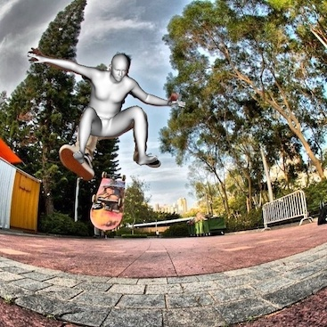
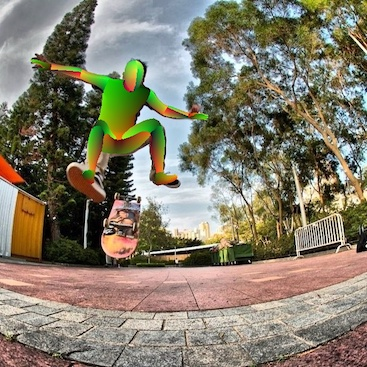
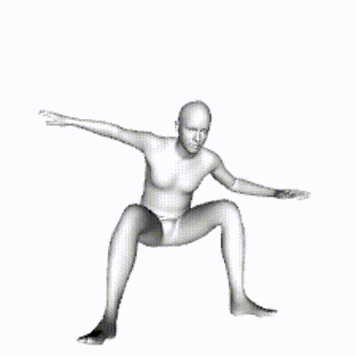

# [Exemplar Fine-Tuning for 3D Human Pose Fitting Towards In-the-Wild 3D Human Pose Estimation](https://arxiv.org/abs/2004.03686)

This repository contains pseudo-GT 3D human pose data produced by [Exemplar Fine-Tuning (EFT)](https://arxiv.org/abs/2004.03686) method, published in [3DV 2021](https://3dv2021.surrey.ac.uk/). The 3D pose data is in the form of [SMPL](https://smpl.is.tue.mpg.de/) parameters, and this can be used as a supervision to train a 3D pose estimation algiritm (e.g., [SPIN](https://github.com/nkolot/SPIN) or [HMR](https://github.com/akanazawa/hmr)). 
We found that our EFT dataset is sufficient to build a model that is comparable to the previous SOTA algorithms without using any other indoor 3D pose dataset. See our [paper](https://arxiv.org/abs/2004.03686) for more details.
<p>
    
    
    
</p>

This repository also contains the pre-trained 3D pose estimation model trained with our EFT dataset and monocular motion capture demo tools. See [README_bodymocap](README_bodymocap.md).
<p>
    
</p>

## News: 
- We have released [FrankMocap](https://github.com/facebookresearch/frankmocap) by which you can obtain both 3D body+hand outputs. The body module is the same as this repository's model. We encourage to use [FrankMocap](https://github.com/facebookresearch/frankmocap) for body pose estimation.

## Installing Requirements
It is convenient and safe to use conda environment
```
conda create -n venv_eft python=3.6
conda activate venv_eft
pip install -r requirements.txt
```

## Download EFT Fitting data (json formats)
This repository only provides corresponding SMPL parameters for public 2D keypoint datasets (such as [COCO](https://cocodataset.org/), [MPII](http://human-pose.mpi-inf.mpg.de/)). You need to download images from the original dataset website.

Run the following script to download our EFT fitting data:
```
sh scripts/download_eft.sh 
```
   - The EFT data will be saved in ./eft_fit/(DB_name).json. Each json file contains a version EFT fitting for a public dataset. 
   - See [Data Format](docs/README_dataformat.md) for details
   - Currently available EFT fitting outputs:


|Dataset Name   |  SampleNum | Manual Filtering |         File Name         |
|---------------| -----------| ---------------- |-------------------------- |
|COCO2014-12kp  | 28344      | No               |  COCO2014-Part-ver01.json |
|COCO2014-6kp   | 79051      | No               |  COCO2014-All-ver01.json  |
|COCO2014-Val   | 10510      | Yes              |  COCO2014-Val-ver10.json  |
|MPII           | 14361      | No               |  MPII_ver01.json          |
|PoseTrack      | 28856      | No               |  PoseTrack_ver01.json     |
|LSPet-Train    | 2946       | Yes              |  LSPet_ver01.json         |
|LSPet-Test     | 2433       | Yes              |  LSPet_test_ver10.json    |
|OCHuman-Train  | 2495       | Yes              |  OCHuman_train_ver10.json |
|OCHuman-Test   | 1783       | Yes              |  OCHuman_test_ver10.json  |


  - COCO2014-All-ver01.json: [COCO](https://cocodataset.org/#home) 2014 training set by selecting the samples 6 keypoints or more keypoints are annotated.
  - COCO2014-Part-ver01.json: [COCO](https://cocodataset.org/#home) 2014 training set by selecting the sample that 12 limb keypoints or more are annotated.
  - COCO2014-Val-ver10.json: [COCO](https://cocodataset.org/#home) 2014 val set. 
  - MPII_ver01.json : [MPII](http://human-pose.mpi-inf.mpg.de/) Keypoint Dataset
  - PoseTrack_ver01.json : [PoseTrack](https://posetrack.net/) Dataset by selecting the sample that 12 limb keypoints or more are annotated.
  - LSPet: [LSPet](https://sam.johnson.io/research/lspet.html) Dataset
  - OCHuman : [OCHuman](https://github.com/liruilong940607/OCHumanApi) Dataset
  - Note that the number of samples are fewer than the original sample numbers in each DB, since we automatically (or manually) filtered out bad samples
  - Manual Filtering: Manual quality check and filtering is done to keep high quality results only. See paper for details

### Download Other Required Data
- SMPL Model (Neutral model: basicModel_neutral_lbs_10_207_0_v1.0.0.pkl):
    - Download in the original [website](http://smplify.is.tue.mpg.de/login). You need to register to download the SMPL data.
    - Put the file in: ./extradata/smpl/basicModel_neutral_lbs_10_207_0_v1.0.0.pkl
    - Copy the smpl pkl file to a different name (SMPL_NEUTRAL.pkl). You need both files:
    ```
    cp ./extradata/smpl/basicModel_neutral_lbs_10_207_0_v1.0.0.pkl ./extradata/smpl/SMPL_NEUTRAL.pkl
    ```


- Densepose (optional, for Densepose rendering): 
  - Run the following script
  ```
      sh scriptsdownload_dp_uv.sh    
  ```
  - Files are saved in ./extradata/densepose_uv_data/
  
## Download Images from Original Public DB website
 - [COCO](https://cocodataset.org/#home): [2014 Training set](http://images.cocodataset.org/zips/train2014.zip)
 - [MPII](http://human-pose.mpi-inf.mpg.de/): [Download Link](https://datasets.d2.mpi-inf.mpg.de/andriluka14cvpr/mpii_human_pose_v1.tar.gz)
 - [LSPet](https://sam.johnson.io/research/lspet.html): [Download Link](http://datasets.d2.mpi-inf.mpg.de/hr-lspet/hr-lspet.zip)

## Visualize EFT Fitting Results
- See [README_eft_vis](README_eft_vis.md)


## Run EFT Fitting by yourself
- See [README_run_eft](README_run_eft.md)


## Motion Capture Demo
- See [README_bodymocap](README_bodymocap.md)

## Citation
```
@inproceedings{joo2020eft,
  title={Exemplar Fine-Tuning for 3D Human Pose Fitting Towards In-the-Wild 3D Human Pose Estimation},
  author={Joo, Hanbyul and Neverova, Natalia and Vedaldi, Andrea},
  booktitle={3DV},
  year={2020}
}
```

## License
[CC-BY-NC 4.0](https://creativecommons.org/licenses/by-nc/4.0/legalcode). 
See the [LICENSE](LICENSE) file. 


## References
The body mocap code is a modified version of [SPIN](https://github.com/nkolot/SPIN), and the majority of this code is borrowed from it.
